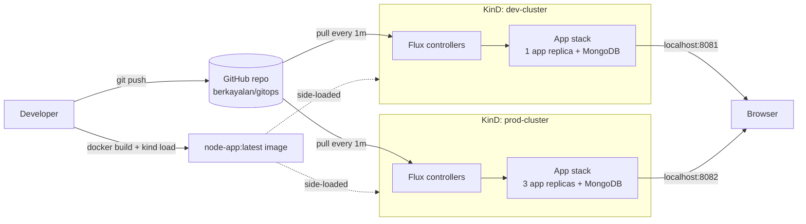
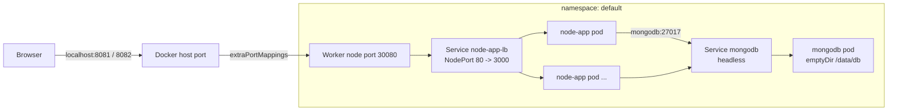
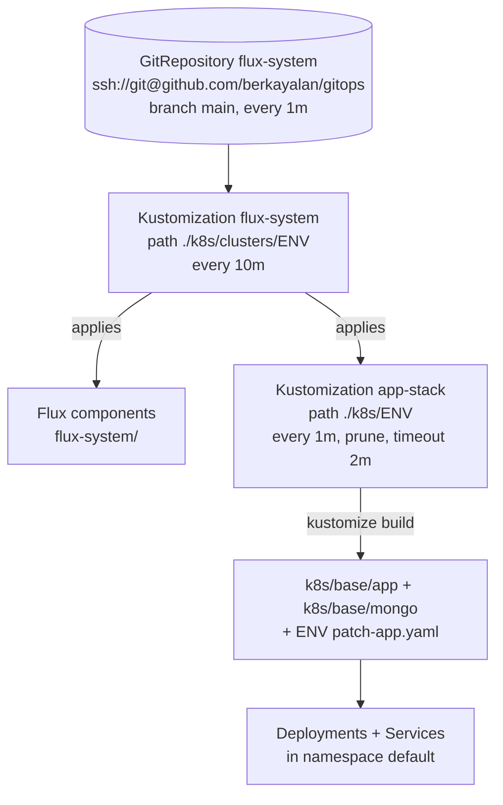
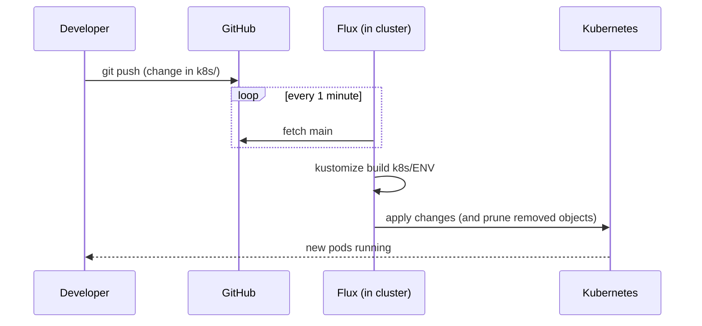

# Architecture

This document explains how this project is built and how its parts work together.

The project is a small Node.js + MongoDB app. It runs on two local Kubernetes clusters (`dev` and `prod`) made with KinD. Flux CD keeps each cluster in sync with this Git repo (GitOps).

## 1. Big picture



Main ideas:

- **Monorepo.** App code, Docker files, cluster configs and Kubernetes manifests are all in this one repo.
- **Git is the source of truth.** You do not run `kubectl apply` by hand. You push to `main`, and Flux applies the change.
- **No image registry.** The image is built on your machine and copied into the cluster nodes with `kind load docker-image`.

## 2. Repo layout

```
gitops/
├── app/                      # Application source
│   ├── server.js             # Express API + static files
│   ├── public/index.html     # Simple web UI
│   ├── package.json
│   ├── Dockerfile            # Builds node-app:latest
│   └── docker-compose.yaml   # Run app + mongo locally without Kubernetes
├── kind/
│   ├── dev-cluster.yaml      # 1 control plane + 3 workers, host port 8081
│   └── prod-cluster.yaml     # 1 control plane + 3 workers, host port 8082
└── k8s/
    ├── base/                 # Shared manifests (same for all envs)
    │   ├── app/              # node-app Deployment + NodePort Service
    │   └── mongo/            # mongodb Deployment + headless Service
    ├── dev/                  # Kustomize overlay for dev (1 replica, APP_ENV=development)
    ├── prod/                 # Kustomize overlay for prod (3 replicas, APP_ENV=production)
    └── clusters/             # Flux entry points, one folder per cluster
        ├── dev/
        │   ├── flux-system/  # Flux components + GitRepository (made by bootstrap)
        │   └── apps.yaml     # Flux Kustomization -> ./k8s/dev
        └── prod/
            ├── flux-system/
            └── apps.yaml     # Flux Kustomization -> ./k8s/prod
```

## 3. The application

| Part | Details |
|---|---|
| Runtime | Node.js 24 (`node:24-bookworm-slim`) |
| Framework | Express 4, Mongoose 8 |
| Port | 3000 |
| Database | MongoDB 6.0, database `tasksdb`, collection for `Item` |
| Config | `APP_ENV` (shown in the UI), `MONGO_URI` (default `mongodb://mongodb:27017/tasksdb`) |

API endpoints:

| Method | Path | What it does |
|---|---|---|
| GET | `/` | Serves the web UI (`public/index.html`) |
| GET | `/api/items` | Lists items, newest first |
| POST | `/api/items` | Creates an item (`{ "title": "..." }`) |
| GET | `/api/info` | Returns `environment` (`APP_ENV`) and `hostname` (pod name) |

`/api/info` shows the pod name, so with 3 replicas in prod you can see requests go to different pods.

## 4. Kubernetes layout (inside one cluster)



| Object | Kind | Notes |
|---|---|---|
| `node-app` | Deployment | Image `node-app:latest`, `imagePullPolicy: IfNotPresent` |
| `node-app-lb` | Service (NodePort) | Port 80 -> 3000, nodePort `30080` |
| `mongodb` | Deployment | Image `mongo:6.0`, 1 replica |
| `mongodb` | Service (headless) | Port 27017, used by the app through DNS name `mongodb` |

How traffic gets in:

1. KinD maps host port `8081` (dev) or `8082` (prod) to port `30080` on the first worker node.
2. Port `30080` is the NodePort of `node-app-lb`.
3. kube-proxy sends the request to any `node-app` pod, on any node.

## 5. Environments

Both clusters use the same `k8s/base`. Each overlay only patches the app Deployment.

| | dev | prod |
|---|---|---|
| KinD cluster | `dev-cluster` | `prod-cluster` |
| kubectl context | `kind-dev-cluster` | `kind-prod-cluster` |
| Nodes | 1 control plane + 3 workers | 1 control plane + 3 workers |
| App replicas | 1 | 3 |
| `APP_ENV` | `development` | `production` |
| URL | http://localhost:8081 | http://localhost:8082 |
| Overlay path | `k8s/dev` | `k8s/prod` |
| Flux path | `k8s/clusters/dev` | `k8s/clusters/prod` |

## 6. GitOps flow with Flux

Each cluster has its own Flux install. Flux has two layers of `Kustomization` objects:



1. **GitRepository `flux-system`** pulls the repo every minute over SSH. It uses the deploy key made by `flux bootstrap`.
2. **Kustomization `flux-system`** applies `k8s/clusters/<env>`. This keeps Flux itself up to date and creates `app-stack`.
3. **Kustomization `app-stack`** builds `k8s/<env>` and applies it. `prune: true` means that if you delete a file from Git, Flux deletes the object from the cluster.

### Change flow



**Manifest change** (for example replicas, env vars): push to `main`. Flux applies it within about 1 minute. To go faster, run `flux reconcile kustomization app-stack --with-source`.

**App code change**: Flux does not build images. You must:

1. `docker build -t node-app:latest ./app`
2. `kind load docker-image node-app:latest --name <cluster>`
3. `kubectl rollout restart deploy/node-app`

The tag stays `latest`, so Kubernetes does not see a change by itself. That is why the restart is needed.

## 7. Data storage

MongoDB uses an `emptyDir` volume. Data is lost when the mongodb pod restarts, moves to another node, or the cluster is deleted. This is fine for a demo. For real persistence, use a PersistentVolumeClaim (KinD ships with the `local-path` storage class).

`docker-compose.yaml` is different: it uses a named Docker volume (`mongo-data`), so data stays between local runs.

## 8. Known limits

- Only one image tag (`latest`), and no registry. There is no image versioning or rollback by tag.
- MongoDB is a single pod with no persistent storage and no auth.
- No health checks (readiness/liveness probes) and no resource limits on the pods.
- No Ingress. Access is through a NodePort on one worker node.
- Everything runs in the `default` namespace.
- Secrets are not used. `MONGO_URI` is plain text in the manifest.
